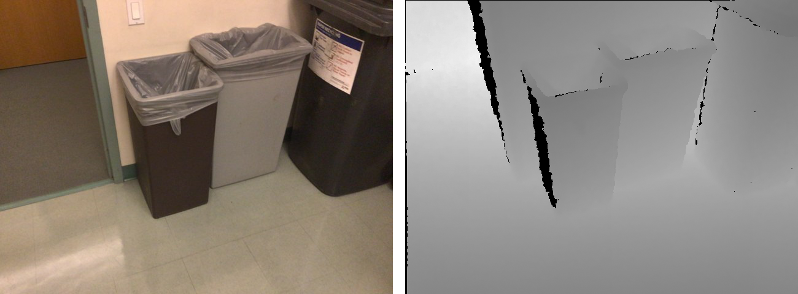
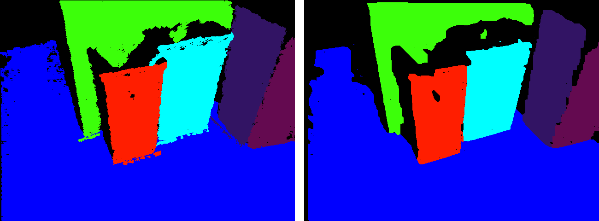

# RGBDPlaneDetection
This code is an implementation of RGB-D plane detection and color-based plane refinement with MRF optimization. 

Example: input color and depth image of `frame-000000` from [BundleFusion dataset](http://graphics.stanford.edu/projects/bundlefusion/)'s [copyroom](http://graphics.stanford.edu/projects/bundlefusion/data/copyroom/copyroom.zip) (the depth image here is scaled by a factor 10 for rendering purpose):



Result planes without (left) and with (right) MRF-based optimization:



## Reference
General pipeline:
```
@inproceedings{wang2018plane,
  title={Plane-Based Optimization of Geometry and Texture for RGB-D Reconstruction of Indoor Scenes},
  author={Wang, Chao and Guo, Xiaohu},
  booktitle={2018 International Conference on 3D Vision (3DV)},
  pages={533--541},
  year={2018},
  organization={IEEE}
}
```
and plane detection on a single RGB-D frame:
```
@inproceedings{feng2014fast,
  title={Fast plane extraction in organized point clouds using agglomerative hierarchical clustering},
  author={Feng, Chen and Taguchi, Yuichi and Kamat, Vineet R},
  booktitle={Robotics and Automation (ICRA), 2014 IEEE International Conference on},
  pages={6218--6225},
  year={2014},
  organization={IEEE}
}
```

## Dependencies
- OpenCV 3
- Eigen 3
- [MRF 2.2](http://vision.middlebury.edu/MRF/code/) (already included)
- Fast plane detection on a single depth image: [PEAC](http://www-personal.umich.edu/~cforrest/research.html) (already included)

## Usage
```
RGBDPlaneDetection <-o> color_image depth_image output_folder
```

`-o` (optional) is to run MRF-based optimization for plane refinement. For example:
```
RGBDPlaneDetection ../pic/frame-000000.color.jpg ../pic/frame-000000.depth.png ../pic 
RGBDPlaneDetection -o ../pic/frame-000000.color.jpg ../pic/frame-000000.depth.png ../pic 
```

Two scripts `demo_win.sh` and `demo_linux.sh` are provided to run the code on a RGB-D sequence. Note to modify the corresponding paths.

## Build
- **Windows**: use Visual Studio to open sln file and compile and build the code. It tests successfully in Visual Studio 2013, and should work on all other Visual Studio platforms. Note to change your OpenCV and Eigen 3 paths if needed.

- **Linux or Mac OS**: run `build_linux.sh` to build the code.

## Running time
Without MRF optimization, the execution code by Visual Studio 2013 runs at about 25 FPS (including data I/O) on RGBD images with resolution 640x480 in a PC with 16GB RAM and intel i7 processor. With MRF optimization, the same code runs much slower at about 7 seconds per frame on the same data.  

## Output
1) Plane segmentation image in PNG;
2) Plane label file in TXT: the label index of the plane which each pixel belongs to, starting from 0 to N - 1 where N is the number of planes. If a pixel is not on any plane, then its label value is N.
3) Plane data file in TXT. Each line represents one plane with format like this:
```
#plane_index(starting from 0 to #planes - 1) number_of_points_on_the_plane plane_color_in_png_image(r,g,b between [0,255]) plane_normal(1x3) plane_center(1x3) sx sy sz sxx syy szz sxy syz sxz
```
Here `(sx sy sz)` are average of sum of all 3D points `(x, y, z)` on the plane, `(sxx syy szz sxy syz sxz)` are the average of sum of `x*x, y*y, z*z, x*y, y*z, z*z` of all 3D points on the plane, respectively.

## Note
- Currently the code only works on [BundleFusion](http://graphics.stanford.edu/projects/bundlefusion/) or [3DLite](http://graphics.stanford.edu/projects/3dlite/) RGBD data. If you want to use other kinds of RGBD data, you need to rewrite the part of reading color and depth images, and reset the camera intrinsic parameters in `plane_detection.h`.
- Note for the scale factor for depth images in `plane_detection.h`.
- Sometimes the MRF 2.2 source code crashes in Visual Studio in Windows due to some kind of memory leak problem, but the code works well in Linux. If you meet the problem, just have a try in Linux, or try to implement the graph-cut/max-flow code by yourself. One suggestion is to use *boykov_kolmogorov_max_flow* in Boost library. 
